# 🏢 Infrastructure Informatique d'Entreprise

## 📖 Présentation du projet

Ce projet consiste à concevoir, déployer et administrer une infrastructure informatique complète simulant l'environnement d'une entreprise.

L'objectif principal est de mettre en œuvre les principales technologies utilisées dans les entreprises pour assurer la gestion des utilisateurs, des services réseau, de la sécurité et de la supervision de l'infrastructure.

L'environnement a été entièrement réalisé dans un laboratoire virtualisé à l'aide de VirtualBox, en intégrant plusieurs serveurs et postes clients afin de reproduire une architecture informatique professionnelle.

---

## 🎯 Objectifs du projet

- Concevoir une architecture réseau d'entreprise.
- Déployer un contrôleur de domaine Windows Server.
- Mettre en place Active Directory.
- Configurer les services DNS et DHCP.
- Sécuriser le réseau à l'aide du pare-feu pfSense.
- Déployer un serveur de supervision Zabbix.
- Superviser les serveurs, les postes clients et les équipements réseau.
- Intégrer les postes clients au domaine Active Directory.
- Configurer la supervision SNMP de pfSense.
- Simuler une infrastructure informatique complète et fonctionnelle.

---

## 🛠 Technologies utilisées

- Windows Server 2022
- Active Directory Domain Services (AD DS)
- Serveur DNS
- Serveur DHCP
- Ubuntu Server
- Zabbix 7
- pfSense Firewall
- VirtualBox
- SNMP
- ICMP
- Bash
- PowerShell

---

## 🏗 Architecture de l'infrastructure

Cette infrastructure comprend notamment :

- Un serveur Windows Server faisant office de contrôleur de domaine.
- Un serveur DNS.
- Un serveur DHCP.
- Un pare-feu pfSense assurant la sécurité et le routage.
- Un serveur Ubuntu hébergeant Zabbix.
- Des postes clients Windows et Linux.
- Une supervision centralisée de l'ensemble de l'infrastructure.
# 📸 Captures d'écran

## 🏗️ Architecture de l'infrastructure

Le schéma ci-dessous présente l'architecture globale de la plateforme de supervision mise en place avec Zabbix.

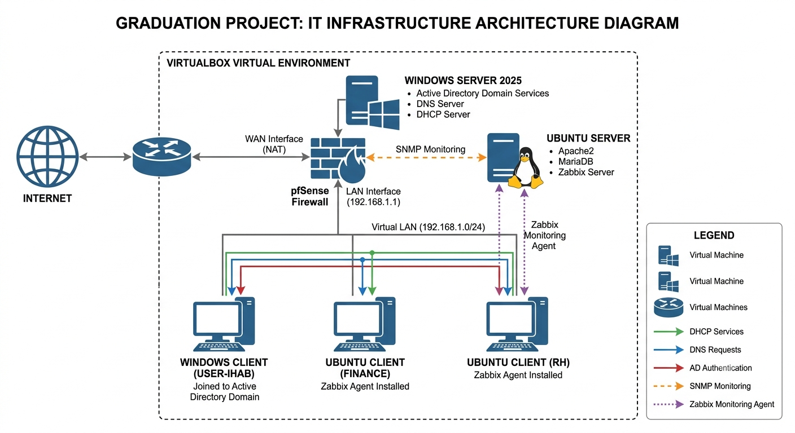

---

## 🌐 Configuration de l'infrastructure réseau

### Serveur principal

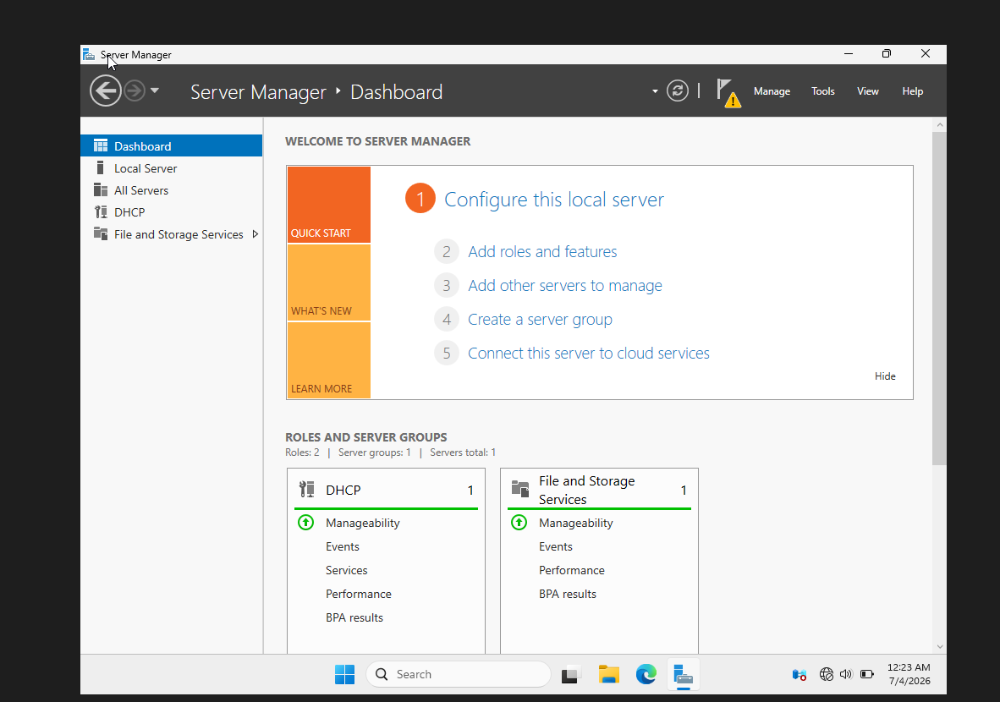

### Configuration du protocole DHCP

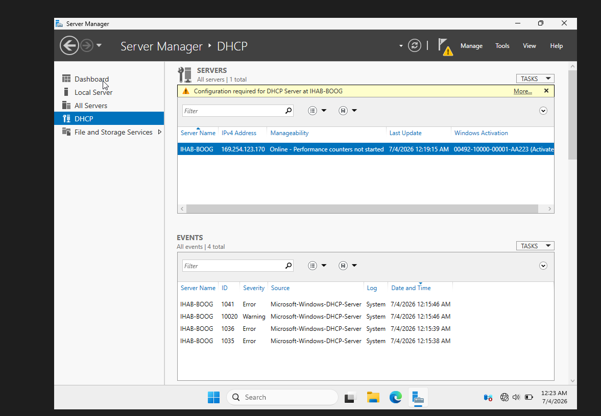

### Configuration de l'étendue DHCP (Scope)

.png)

### Validation de l'attribution des adresses IP

---

## 🖥️ Configuration d'Active Directory

### Installation des services Active Directory (AD DS)

.png)

### Gestion des utilisateurs de l'OU IT

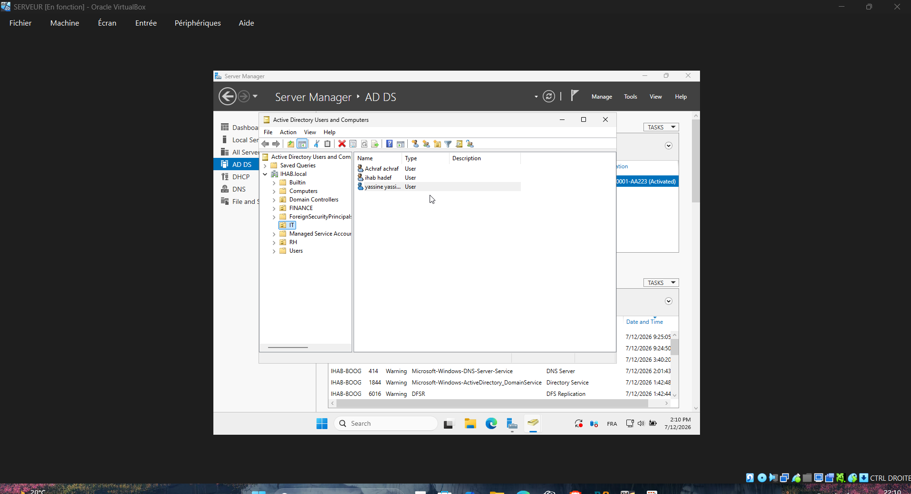

### Intégration du poste client au domaine

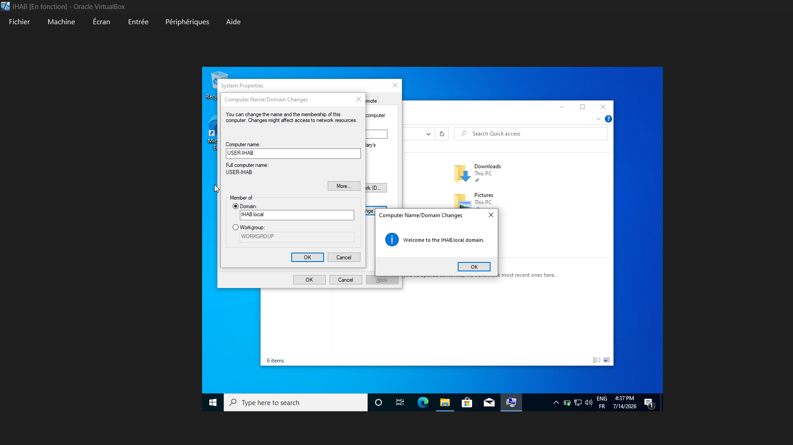

---

## 🔥 Configuration de pfSense

### Accès à l'interface Web de pfSense

.png)

### Vérification de la connectivité entre pfSense et les clients

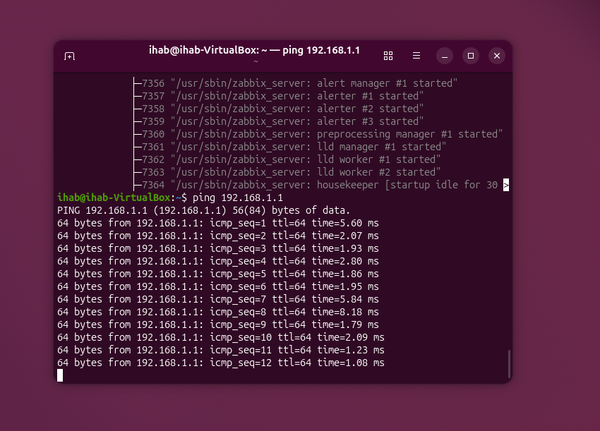

### Clients LAN connectés

.png)

### Installation du service SNMP

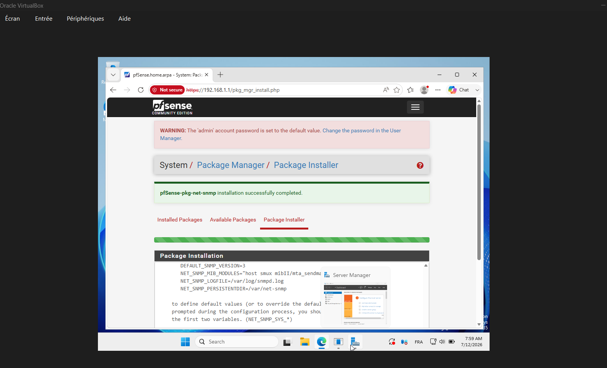

### Intégration de pfSense dans Zabbix via SNMP

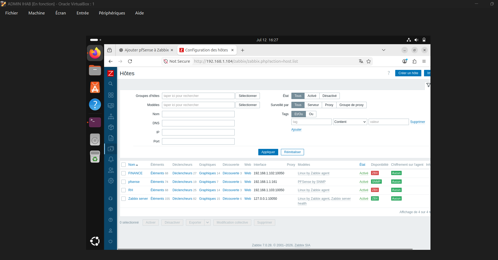

---

## 📊 Déploiement du serveur Zabbix

### Vérification du service Apache

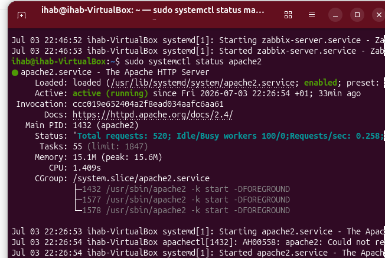

### Vérification du service MariaDB

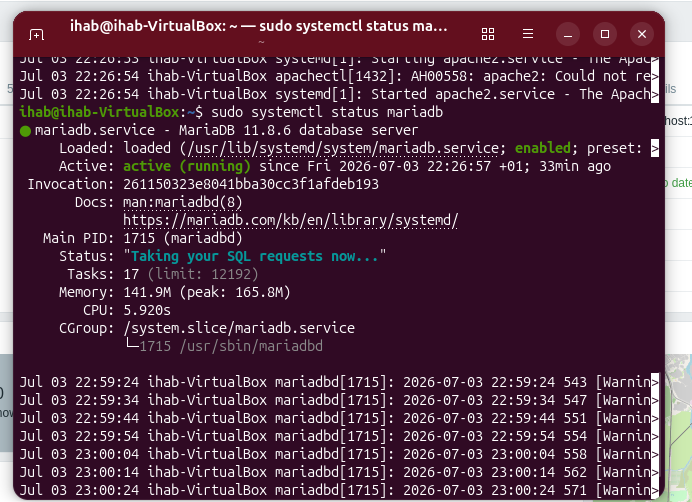

### Vérification du serveur Zabbix

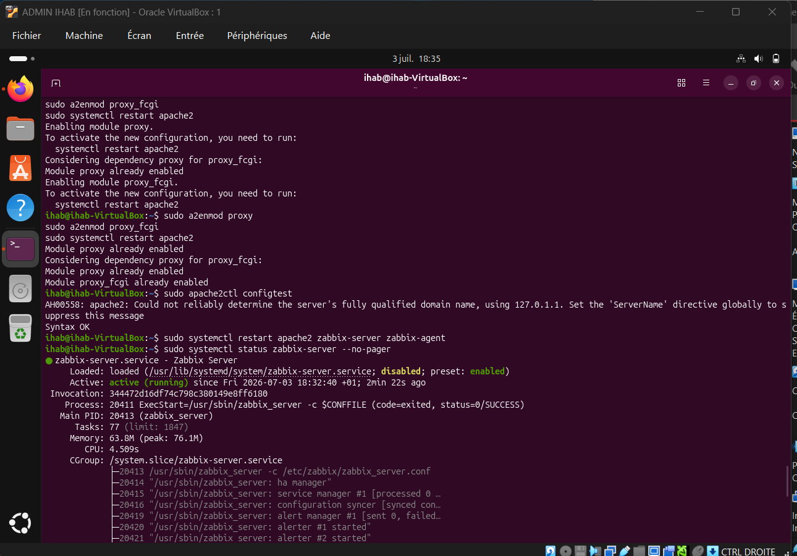

### Vérification de l'agent Zabbix

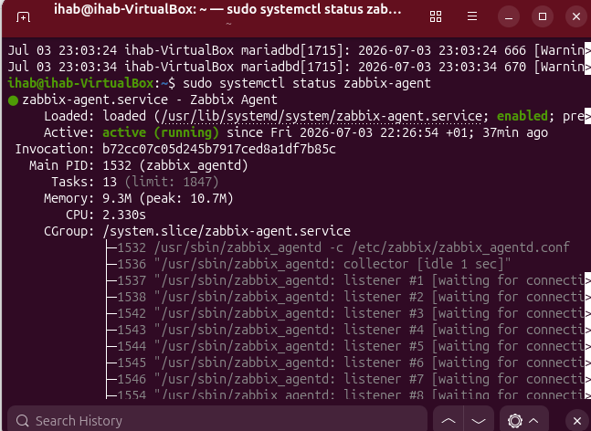

---

## 🖥️ Ajout des hôtes supervisés

### Connexion des clients RH et FINANCE

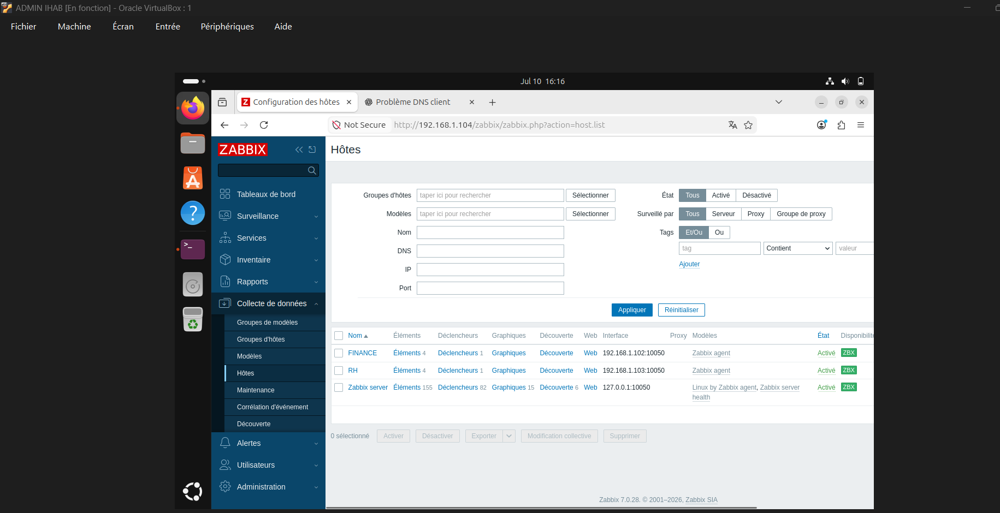

---

## 📈 Supervision des ressources

### Supervision du client FINANCE

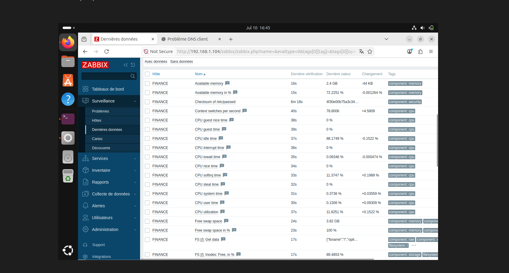

### Supervision du client RH

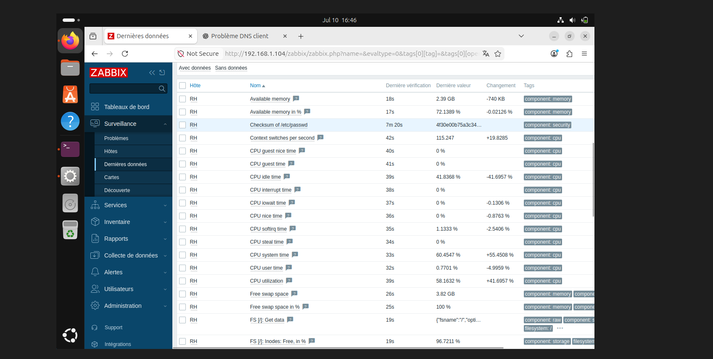

---

## 🚨 Mise en place des alertes

### Création du déclencheur CPU

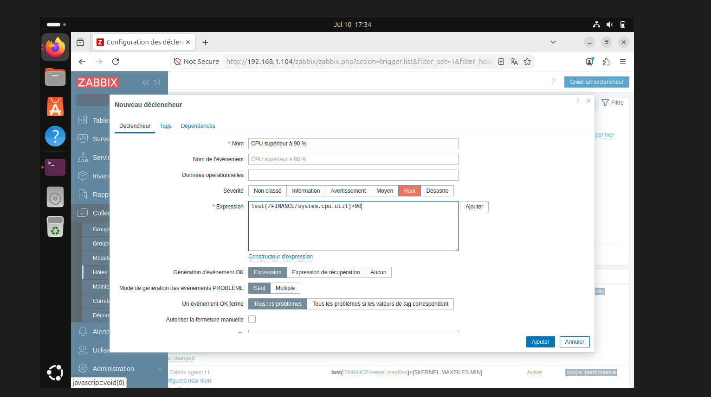

### Création du script de remédiation automatique

### Création de l'action automatique

### Détection d'une surcharge CPU

### Résolution automatique du problème

---

## 📊 Tableau de bord

### Dashboard Zabbix

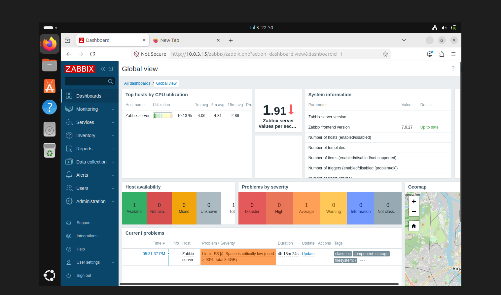
---

## 🚀 Fonctionnalités mises en œuvre

- Gestion centralisée des utilisateurs avec Active Directory.
- Création d'Unités d'Organisation (OU).
- Attribution automatique des adresses IP via DHCP.
- Résolution de noms grâce au serveur DNS.
- Sécurisation du réseau avec pfSense.
- Supervision des serveurs et des équipements avec Zabbix.
- Surveillance des performances CPU, mémoire et disponibilité des hôtes.
- Supervision SNMP du pare-feu pfSense.
- Génération d'alertes automatiques en cas d'incident.

---

## 💼 Compétences développées

- Administration Windows Server
- Active Directory
- Administration Linux
- Administration Réseau
- DNS
- DHCP
- Firewall pfSense
- Supervision avec Zabbix
- SNMP
- Virtualisation
- Déploiement d'infrastructure informatique
- Résolution de problèmes réseau

---

## ✅ Résultat

Ce projet démontre ma capacité à concevoir, déployer, sécuriser et superviser une infrastructure informatique complète, similaire à celle utilisée dans une entreprise.
Il met en pratique des compétences en administration systèmes, réseaux, sécurité et supervision, tout en respectant les bonnes pratiques professionnelles.
